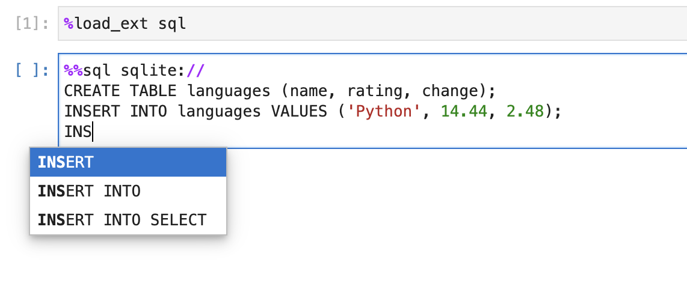

---
jupytext:
  text_representation:
    extension: .md
    format_name: myst
    format_version: 0.13
    jupytext_version: 1.14.5
kernelspec:
  display_name: Python 3 (ipykernel)
  language: python
  name: python3
myst:
  html_meta:
    description lang=en: Enable SQL keywords autocompletion in JupyterLab
    keywords: jupyter, jupyterlab, sql
    property=og:locale: en_US
---

# SQL keywords autocompletion

+++

JupySQL natively supports autocompletion of the most common SQL keywords. The user may press the `tab` key while typing the keyword to view the list of suggestions.


## Installation

Optionally, create a new environment with JupyterLab installed:

```sh
conda create --name jupysqlenv python=3.10 jupyterlab --yes --channel conda-forge
conda activate jupysqlenv
```

+++

To run SQL queries on Jupyter, install [JupySQL](https://github.com/ploomber/jupysql):

```bash
pip install jupysql --quiet
```

+++

Now, start Jupyter Lab, and try out the autocomplete feature:




