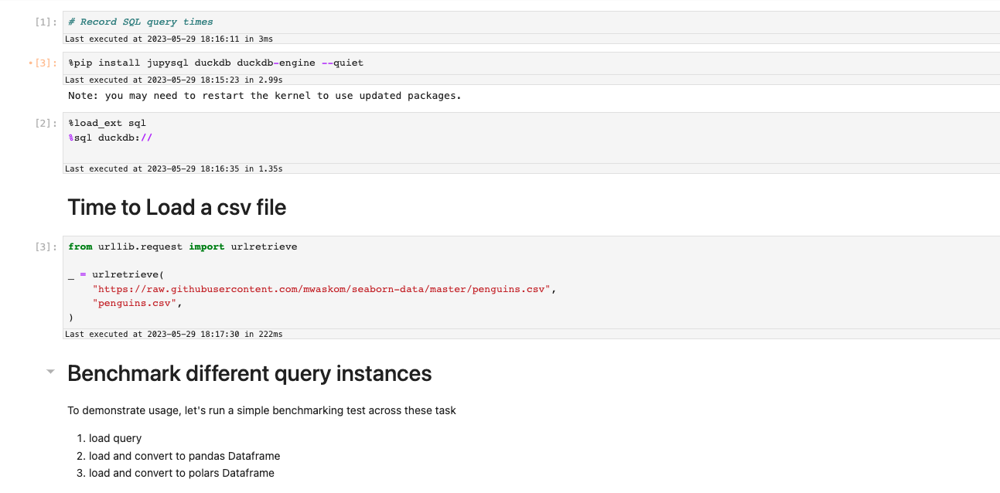

---
jupytext:
  notebook_metadata_filter: myst
  text_representation:
    extension: .md
    format_name: myst
    format_version: 0.13
    jupytext_version: 1.14.5
kernelspec:
  display_name: Python 3 (ipykernel)
  language: python
  name: python3
myst:
  html_meta:
    description lang=en: Display cell runtime in JupyterLab
    keywords: jupyter, jupyterlab, sql
    property=og:locale: en_US
---

# Benchmarking runtime
To record the time taken to run each cell
in JupyterLab, we suggest using `jupyterlab-execute-time` 

## Installation

```sh
pip install jupyterlab_execute_time
```

# Enable Record metadata Settings
This plugin displays the metadata collected by the 
JupyterLab notebook, to ensure that the time is collected
as part of the metadata, enable the record-time feature in 
notebook settings
`Settings -> Notebook -> Recording timing`


# Note the time taken to run each cell!



# This extension can be used for benchmarking tasks

