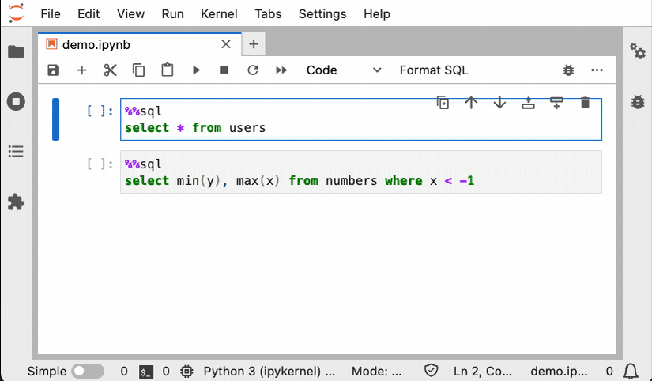

---
jupytext:
  notebook_metadata_filter: myst
  text_representation:
    extension: .md
    format_name: myst
    format_version: 0.13
    jupytext_version: 1.14.5
kernelspec:
  display_name: Python 3 (ipykernel)
  language: python
  name: python3
myst:
  html_meta:
    description lang=en: Format your SQL cells in Jupyter
    keywords: jupyter, jupyterlab, sql
    property=og:locale: en_US
---

# SQL formatting

+++

To enable SQL formatting, install `jupysql-plugin`:

```sh
pip install jupysql-plugin --upgrade
```

Then, a "Format SQL" button will appear in JupyterLab:


