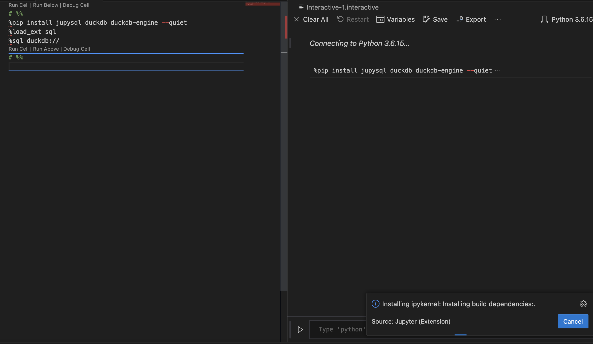
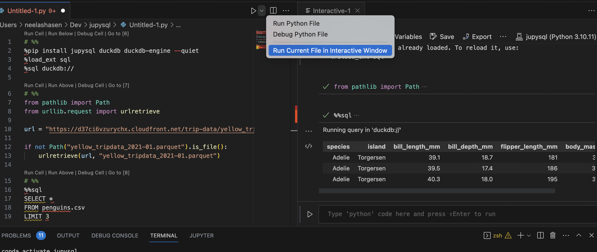
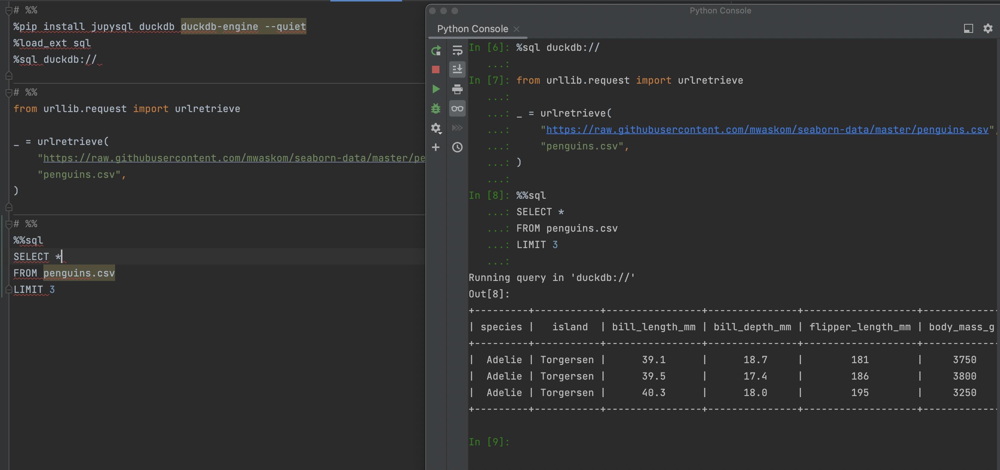
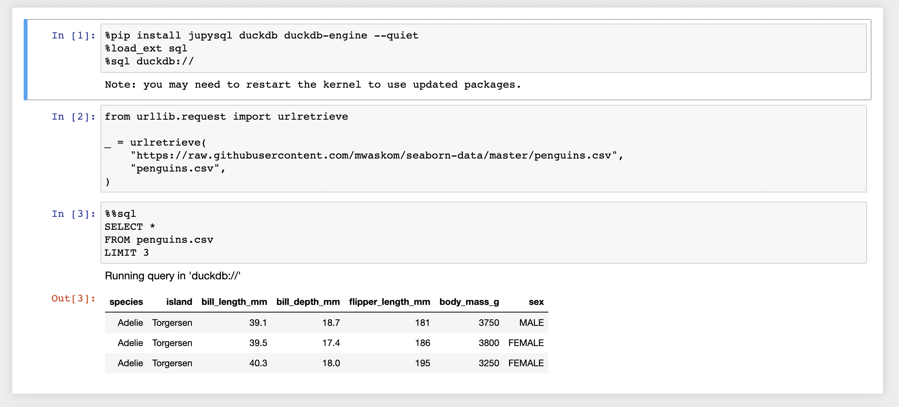

---
jupytext:
  notebook_metadata_filter: myst
  text_representation:
    extension: .md
    format_name: myst
    format_version: 0.13
    jupytext_version: 1.14.5
kernelspec:
  display_name: Python 3 (ipykernel)
  language: python
  name: python3
myst:
  html_meta:
    description lang=en: Embed SQL queries in .py file
    keywords: jupyter, sql, jupysql
    property=og:locale: en_US
---

# Use JupySQL in `.py` scripts

We have seen how JupySQL allows users to run SQL queries via the `%sql` and `%%sql` magics, but what if you want to execute SQL queries in a `.py` script instead?
In this tutorial, we'll demonstrate how to embed JupySQL magics in a Python file using VSCode and Spyder.

## Python Interactive Window in VSCode

VSCode allows users to work with Jupyter-like code cells and run code in the Python Interactive Window. To work with these code cells, first, select the Python environment in which JupySQL is installed. To select an environment, use the **Python: Select Interpreter** command from the Command Palette.

Once done, you can define Jupyter-like code cells within Python code using a `# %%` comment. For more details, refer [VSCode Jupyter support](https://code.visualstudio.com/docs/python/jupyter-support-py).

Here's a code snippet that allows users to download a sample dataset and perform SQL queries on the data using JupySQL's `%%sql` cell magic.

## Sample code

```python
# %%
%pip install jupysql duckdb duckdb-engine --quiet
%load_ext sql
%sql duckdb://

# %%
from urllib.request import urlretrieve

_ = urlretrieve(
    "https://raw.githubusercontent.com/mwaskom/seaborn-data/master/penguins.csv",
    "penguins.csv",
)

# %%
%%sql
SELECT *
FROM penguins.csv
LIMIT 3
```

Now let's look at the steps for running this code in VSCode.

First, create a new file and select the file type as `Python File` as shown below:


Now, add a code cell and try to run the cell. It would prompt the user to install the `ipykernel`.



Ensure to select the correct Python environment for the code cell to run properly:


Now, run the file in the interactive mode as shown below. You may also run each cell individually by clicking the `Run Cell` option.



## Python Interactive Window in Spyder

The Spyder IDE also supports the `# %%` format for running Python code cells interactively as we can see below:


## Python Interactive Window in PyCharm

The percent format is also supported by `PyCharm Professional`:



[Click here](https://jupytext.readthedocs.io/en/latest/formats.html#the-percent-format) for more details on the percent format.

## Programmatic Execution

Users may be interested in running the scripts programmatically. This can be achieved by using `jupytext` and [ploomber-engine](https://engine.ploomber.io/en/latest/quick-start.html). `ploomber-engine` is a toolbox for executing notebooks.

Let's say we save the code snippet in a file named `sql-analysis.py`. Run the below commands in the terminal to run it programmatically.

```bash
pip install ploomber-engine
jupytext sql-analysis.py --to ipynb
ploomber-engine sql-analysis.ipynb output.ipynb
```

The `output.ipynb` should look like:




